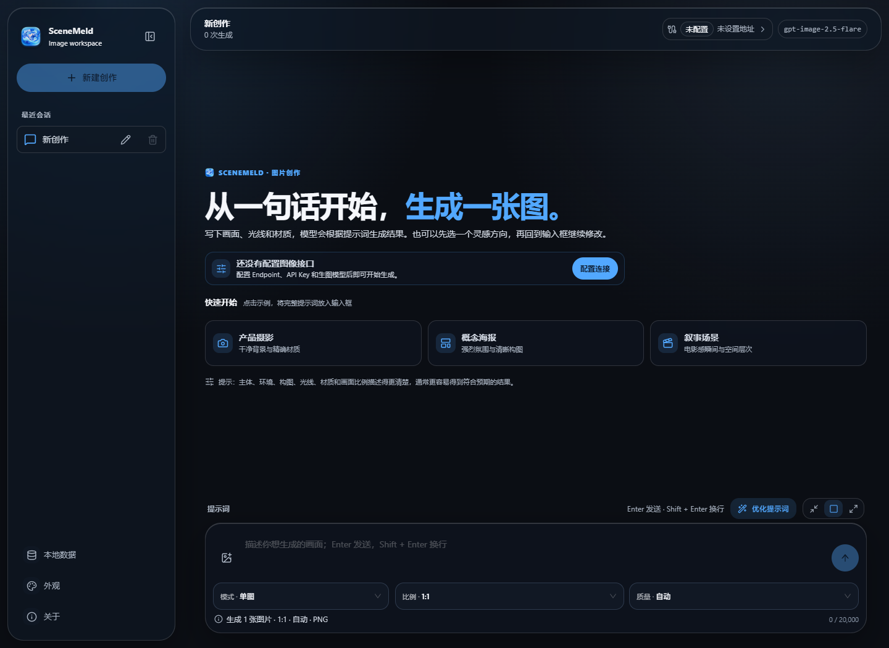
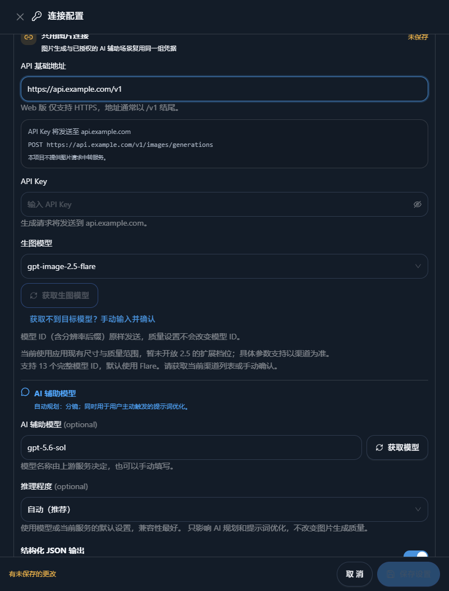
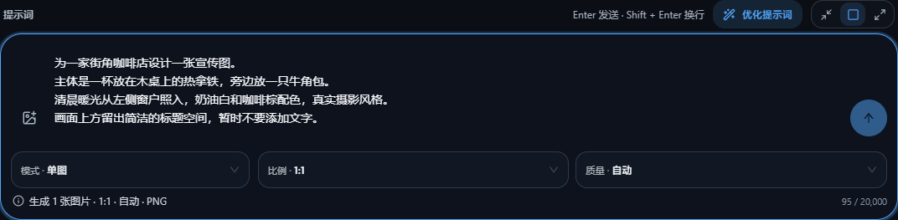
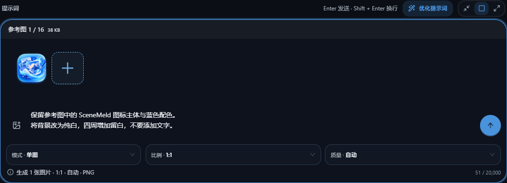
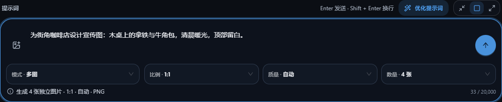
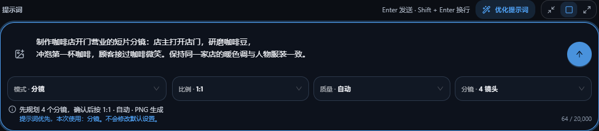
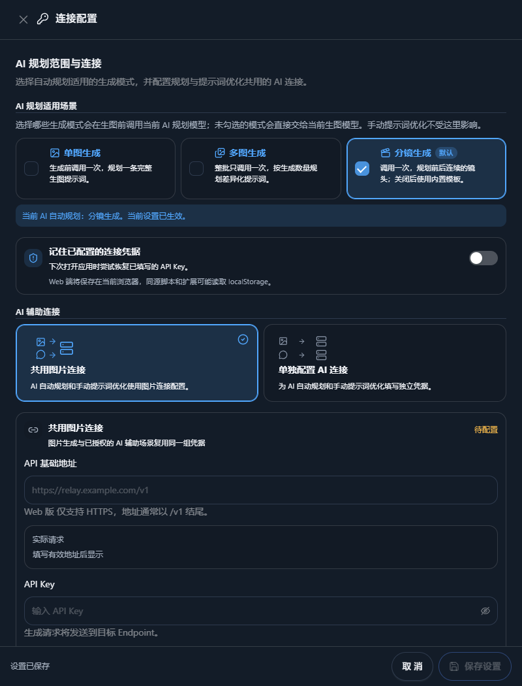
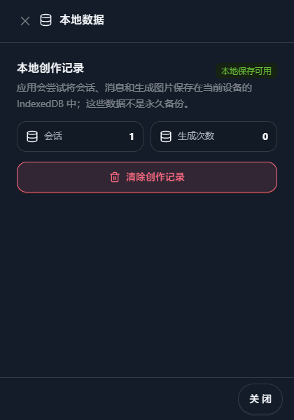

# SceneMeld User Guide

This guide takes first-time users through connection setup, creating a coffee-shop promotional image, editing with references, and saving their work. It covers the Web and Desktop apps in the current repository; older deployments or installed releases may not include every feature.

English | [简体中文](./user-guide.zh-CN.md)

[Project overview](../README.md) · [Open Web app](https://scene-meld.clovemu.com/) · [Desktop releases](https://github.com/yesw6a/scene-meld/releases)

The images below are actual screenshots of [SceneMeld Web](https://scene-meld.clovemu.com/) in dark mode, captured on September 16, 2026. Both guides share the same Chinese-interface screenshots. Select **Appearance → Dark (外观 → 深色)** in the sidebar to match the theme shown. They use a placeholder URL and an empty API key; no generation service was called. Result, continue-editing, version-comparison, and storyboard-review instructions describe the current implementation but have not been verified through real generation. See [screenshot notes](./images/README.md) for provenance and recapture instructions. English button names are translations; the **Chinese labels** in parentheses help you find them in the interface.

## Contents

- [1. Before you begin](#1-before-you-begin)
- [2. First-time setup](#2-first-time-setup)
- [3. Create your first image](#3-create-your-first-image)
- [4. References and further edits](#4-references-and-further-edits)
- [5. Retry and compare versions](#5-retry-and-compare-versions)
- [6. Batches and storyboards](#6-batches-and-storyboards)
- [7. Optional AI assistance](#7-optional-ai-assistance)
- [8. Manage conversations and images](#8-manage-conversations-and-images)
- [9. Troubleshooting](#9-troubleshooting)
- [10. Storage and privacy](#10-storage-and-privacy)

## 1. Before you begin



*Figure 1. The initial workspace. Open settings through “配置连接” in the center or “未配置” at the top right. The composer is at the bottom.*

Obtain the following from your chosen API provider:

- **API base URL (Endpoint):** the service that receives your image requests.
- **API key:** a key with permission to use that service's image models.
- **Available model ID:** a complete image model name supported by both the service and the app's candidate list.

SceneMeld provides the creative workspace, not an API, credits, accounts, or a request relay. Pricing, model access, and availability depend on your provider. Reference-based generation also requires image-editing support.

| Edition | How to open it | Requirements |
| --- | --- | --- |
| Web | Use the Web app link above | The service must allow browser cross-origin access (CORS) |
| Desktop | Choose the installer for your OS and architecture on the releases page | Requests run on your device without browser CORS restrictions |

Desktop builds cover Windows x64, macOS Intel, macOS Apple Silicon, and Linux x64. Check the release assets for available downloads. Desktop still requires network access, a valid API key, and model permissions.

## 2. First-time setup



*Figure 2. The connection drawer scrolled down to its fields. The URL is a placeholder. Fetch image models is disabled because no API key has been entered.*

1. Click **Configure connection (配置连接)** on the welcome screen, or the connection status at the top right, to open **Connection settings (连接配置)**.
2. Scroll down to **API base URL (API 基础地址)** and **API Key**, then enter your provider's details.
3. Under **Image model (生图模型)**, click **Fetch image models (获取生图模型)** and select a supported model returned by your provider.
4. For your first attempt, you can uncheck all **AI planning scenarios (AI 规划适用场景)** and keep **Share image connection (共用图片连接)** selected. Set up AI assistance later.
5. Choose whether to remember credentials, then click **Save settings (保存设置)**.

### Which URL should you enter?

Suppose your provider gives you this base URL:

```text
https://api.example.com/v1
```

This is a placeholder; replace it with your provider's actual address. The app appends image API paths, such as `https://api.example.com/v1/images/generations`. Do not enter the full `/images/generations` or `/images/edits` URL in the base URL field. Whether `/v1` is required depends on your provider.

Check the request preview and the hostname shown beside **API key will be sent to (API Key 将发送至)**. Production use requires HTTPS. The URL must not contain a username, password, query parameters, or a `#` fragment.

### What if fetching models fails?

Click **Cannot find the target model? Enter and confirm manually (获取不到目标模型？手动输入并确认)**, enter a full ID from the app's candidate list, click **Confirm selection (确认使用)**, and save. This neither verifies provider permissions nor generates a test image.

The current default ID is `gpt-image-2.5-flare`; candidates also include the `gpt-image-2` family. Use the current candidate list and your provider's permissions as the reference. Arbitrary model names are not accepted. Resolution suffixes are sent unchanged; changing image quality does not switch the model ID.

**Saved or configured does not mean connected.** A successful generation is needed to confirm the configuration works.

## 3. Create your first image



*Figure 3. The actual composer before sending. The image-plus icon at the lower left adds references; the blue upward arrow sends the prompt. The operation summary is at the bottom.*

1. On your first visit, use the existing blank **New creation (新创作)** conversation. Once you have created content, click **New creation (新建创作)** in the sidebar to start another task. That button may be disabled while a blank conversation already exists.
2. Set **Mode (模式)** to **Single image (单图)**, **Aspect ratio (比例)** to square, and **Quality (质量)** to automatic.
3. Enter the example prompt below.
4. After saving your connection settings, click the blue upward arrow on the right or press `Enter` to send; use `Shift + Enter` for a new line.
5. Once generation finishes, click the result to preview it and use the image action menu to download it.

```text
Create a promotional image for a neighborhood coffee shop.
Show a hot latte on a wooden table with a croissant beside it.
Warm morning light enters through a window on the left. Use cream and
coffee-brown colors with a realistic photographic style.
Leave clean space at the top for a headline, but do not add text yet.
```

A successful request displays an image. If it fails, read the error on the result and consult the troubleshooting section.

Aspect ratio options include automatic, square, widescreen, portrait screen, landscape photo, and portrait photo. Automatic lets the model decide; other ratios also depend on the target service's capabilities. Quality options are automatic, low, medium, and high. Processing time and pricing depend on the provider.

Before sending, check the **Current operation (本次操作)** summary. Recognized mode, quantity, or specification instructions in the prompt may override the current selection for that request without changing your defaults.

You can stop a request while it is running. Stopping locally does not guarantee the provider cancels processing or billing.

## 4. References and further edits



*Figure 4. Upload demonstrated with the project's SceneMeld icon. Its thumbnail and “参考图 1 / 16” are visible. No generation request has been submitted.*

### Upload your own image

1. Click the image-plus icon at the lower left of the input (its tooltip says **Add reference image / 添加参考图**), or drag or paste an image into the input area.
2. Check that its thumbnail appears and remove unwanted references.
3. Describe what to preserve and what to change, then send.

To reproduce the screenshot, download the [project icon](../public/app-icon.png), upload it, and enter: “Preserve the SceneMeld icon and its blue palette. Change the background to white, add space around it, and do not add text.”

To continue the coffee-shop example, use your own coffee-cup photo and enter:

```text
Preserve the shape and color of the cup in the reference image.
Change the background to a neighborhood coffee shop in the morning,
with a wooden table and soft window light.
Keep the cup's logo unchanged and leave space at the top for a headline.
```

Supported formats are PNG, JPEG, WebP, and GIF. You can add up to 16 references, with a 20 MB limit per image and a 50 MB total limit. Your provider may impose stricter limits. Reference-based generation requires `/images/edits` support.

### Edit a generated result

1. Choose **Continue editing (继续修改)** on the target image.
2. The app places that result in the composer as a reference and restores its revised or original prompt.
3. Edit the prompt to state your changes, for example: “Keep the composition and cup, change the background to warm evening light, and add ‘Today's Special’ at the top.”
4. Check the reference and text, then send.

Continue editing does not immediately send a request. If you want to build on a particular result, make sure it appears in the reference area; its presence in the conversation history alone is not enough.

## 5. Retry and compare versions

To try the same requirements again for one image, use **Retry this image with original settings (按原设置重试此张)**. To change the content, use **Continue editing (继续修改)** and revise the prompt.

The previous version remains visible during a retry. When the new version is ready, switch between **Previous / New version (上一版 / 新版本)** or open **Side-by-side comparison (并排对比)**. Then select **Keep previous version (保留上一版)** or **Use new version (采用新版本)**.

Only one image remains after selection, and you must choose before retrying again. Download each version before choosing if you want both. A failed or stopped retry retains the previous version. Each retry sends a new generation request.

If the app reports an aspect ratio mismatch (比例未匹配), it keeps the generated image. Review it before deciding whether to retry with the original settings.

## 6. Batches and storyboards

### Batches: try several results at once



*Figure 5. Selecting multiple-image mode reveals the quantity control. Here it is set to four, and the summary updates to four independent images.*

1. Switch **Mode (模式)** to **Multiple images (多图)**.
2. Choose a quantity from 2–9 and describe the image you want.
3. Review the operation summary, send, and check each image's status in the result grid.

A batch produces independent images, not a continuous story. With batch AI planning enabled, the app first plans differentiated prompts for the batch. Retry an individual failed image without regenerating the entire batch.

### Storyboards: create connected scenes



*Figure 6. Storyboard mode before sending, with four shots selected. No plan review or image generation has started.*

1. Switch **Mode (模式)** to **Storyboard (分镜)** and choose automatic or 3, 4, 6, or 9 shots.
2. Describe the whole story, for example:

```text
Create a short-film storyboard of a coffee shop opening for the day:
the owner opens the door, grinds coffee beans, brews the first cup,
and hands it to a smiling customer. Keep the shop's warm palette
and the characters' clothing consistent throughout.
```

3. After sending, review the shared visual direction in **Confirm storyboard plan (确认分镜方案)** and check or edit each shot's title and description.
4. Image requests begin only after you click **Generate N storyboard images (开始生成 N 张分镜图)**. Select **Return to prompt (返回提示词)** to revise your input.

Storyboard AI planning is on by default and needs a working AI assistance connection. When disabled, the app uses a built-in template. Each shot produces one image. Character and scene consistency still depend on model output, so review every shot.

## 7. Optional AI assistance



*Figure 7. The top of the connection drawer. Single-image, batch, and storyboard planning have separate checkboxes. Only storyboard planning is checked by default.*

Basic image generation does not require automatic AI planning. To use planning or manual prompt optimization, configure **AI assistance connection (AI 辅助连接)**:

1. If the service supports both images and conversation, select **Share image connection (共用图片连接)**. Otherwise, select **Configure AI connection separately (单独配置 AI 连接)** and enter its Endpoint and API key.
2. Fetch or enter a supported conversation model under **AI assistance model (AI 辅助模型)**. This is separate from the image model.
3. Start with automatic **Reasoning effort (推理程度)**. Enable **Structured JSON output (结构化 JSON 输出)** only if the service supports `response_format`.
4. Select the scenarios that should use automatic planning and **Save settings (保存设置)**.

| Scenario | Behavior when enabled |
| --- | --- |
| Single image | Plans one complete prompt before generation |
| Multiple images | Plans different prompts for the batch |
| Storyboard | Plans connected shots for review before generation |

Single-image and batch planning are off by default; storyboard planning is on. Reasoning effort affects planning and prompt optimization, not image quality. AI assistance makes additional requests to the configured service and may incur extra charges.

### Optimize a prompt manually

Enter text and click **Optimize prompt (优化提示词)**. Compare the result with your original and edit it if needed. Select **Replace input (替换输入框)** to apply it, or **Keep original (保留原文)** to discard it. The result is not sent automatically; you still submit generation yourself.

Manual optimization works independently of the automatic planning checkboxes but still needs a valid AI assistance connection. If the result is marked **Safety recheck failed (未通过安全复检)**, it cannot replace the input; revise your creative direction before trying again.

## 8. Manage conversations and images



*Figure 8. Open this drawer using “本地数据” at the bottom of the sidebar. This screenshot only displays status; no records were cleared.*

- **Conversations:** switch projects under **Recent conversations (最近会话)** in the sidebar. Rename the example conversation to “Coffee-shop promotion.” On narrow screens, use **Open conversation list (打开会话列表)** at the top.
- **Preview:** click an image to enlarge it and browse other images in the same conversation.
- **Copy and download:** use the image action menu. Copying requires browser or system clipboard support and permission; download if copying is unavailable.
- **Delete a conversation (删除):** removes its messages, references, generated images, and unsent content. There is no in-app undo.
- **Appearance (外观):** choose light, dark, or system appearance from the workspace tools.
- **Clear all records:** under **Local data (本地数据)**, use **Clear creation history (清除创作记录)** to delete all conversations, messages, and saved images without changing connection settings.
- **Clear connection settings (清除连接配置):** retains creation history, but you must re-enter connection details before generating again.

Download anything you want to keep before deleting or clearing data. Some conversation actions are unavailable during generation; wait for completion or stop the request first.

## 9. Troubleshooting

| Symptom | What to check |
| --- | --- |
| Invalid base URL | Use the provider's HTTPS base URL; remove query parameters, fragments, and full image-route suffixes. Check the request preview |
| 401 or 403 | Check the key, expiry, and model permissions. Make sure the URL and key belong to the same service |
| 404 or model not found | Check the base path and full model ID. Fetch the model list and confirm support with your provider |
| Cannot fetch model list | Check connection and permissions. Once provider support is confirmed, manually select an ID from the app's candidates |
| Web network or CORS error | The service must allow OPTIONS preflight, POST, Authorization, and Content-Type. Remote image URLs must also allow cross-origin reads. You can also try Desktop |
| Text-to-image works but references fail | Check image-editing support and reference format, count, and size |
| Rate limit, insufficient credits, or service error | Check the provider's quota, limits, and status. Retry later instead of repeatedly submitting |
| AI planning or prompt optimization fails | Check the AI connection, conversation model, and structured-output compatibility. Disable the relevant automatic planning scenario to use basic generation |
| Wrong aspect ratio | Check the operation summary and model support. Keep usable results and retry if needed |
| Cannot copy an image | Check clipboard permissions, close apps that may be holding the clipboard, or download instead |
| Cannot read or download an image | The local file may have been cleared or a remote URL expired. Existing records do not guarantee recovery; regenerate if necessary |
| Asked for a key after reopening | Expected if credentials were not remembered. Otherwise, check browser storage or the system credential manager |
| Temporary storage or save failure notice | Local storage is unavailable. Download images before closing the app or page |

When reporting a problem, include the app version, edition (Web/Desktop), steps, and error text. Hide API keys and private content in screenshots.

## 10. Storage and privacy

Conversations, references, and generated images are saved to IndexedDB in the current browser or Desktop WebView when available. Local storage is not cloud sync or permanent backup. Do not expect records to appear automatically after switching devices, browsers, or site addresses, or clearing application data.

API keys stay in memory by default. If you remember credentials, Web uses localStorage, which same-origin scripts and extensions may read. Desktop attempts to use the system credential manager; protection depends on the OS and account configuration.

Generation connects to your configured service, and AI assistance also sends requests to its configured service. The provider determines retention, content rules, and pricing. Download important work separately.

Read the [privacy notice](../PRIVACY.md) and [security notice](../SECURITY.md) for more information. Development and deployment instructions are in the [README](../README.md).
